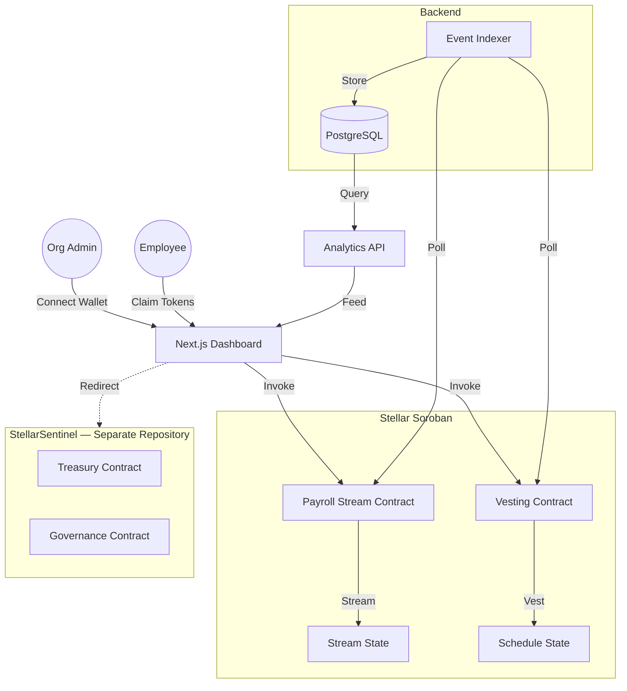

# StellarPay

Decentralized Payroll & Token Vesting Protocol on Stellar Soroban.

```
   _____ _            ____            ____        __
  / ____| |          / __ \___  _____/ __ \____ _/ /_____ _
 | (___ | | _____  _| |  | \ \/ / __/ / / / __ `/ __/ __ `/
  \___ \| |/ / _ \/ / |  | |>  </ /_/ /_/ / /_/ / /_/ /_/ /
  ____) |   <  __/ | |__| /_/\_\__,_.___/\__,_/\__/\__,_/
 |_____/|_|\_\___|_|\____/    /____/
```

**StellarPay** is a protocol that enables startups, DAOs, and remote-first organizations to manage payroll and token vesting entirely on-chain using Stellar Soroban smart contracts.

> **⚠️ Module Boundary Notice:** Treasury and governance functionality has moved to [StellarSentinel](https://github.com/Stellar-Re-Code/StellarSentinel). See [docs/MODULE_BOUNDARY.md](docs/MODULE_BOUNDARY.md) for the disposition matrix and migration timeline. The `contracts/treasury/` and `contracts/governance/` crates remain in this repository temporarily during migration but are deprecated.

## 💡 The Idea

Build an on-chain payroll and vesting protocol:
- **Payroll Streaming**: Continuous token distribution, claimable in real-time
- **Token Vesting**: Cliff + linear vesting for team, advisors, and investors

Treasury (multi-sig vault) and governance (proposals + voting) are owned by [StellarSentinel](https://github.com/Stellar-Re-Code/StellarSentinel). See [docs/MODULE_BOUNDARY.md](docs/MODULE_BOUNDARY.md) for details.

## 🏗️ Architecture



## 🛠 Tech Stack

| Layer | Technology |
|-------|-----------|
| **Smart Contracts** | Soroban (Rust), `soroban-sdk 22.0.0` |
| **Frontend** | Next.js 14, TypeScript, Tailwind CSS |
| **Wallet** | Freighter Wallet |
| **Indexing** | Custom Soroban-RPC event poller |
| **Database** | PostgreSQL, Redis |
| **CI/CD** | GitHub Actions |

## 📂 Repository Structure

```
StellarPay/
├── contracts/                        # Soroban workspace
│   └── contracts/
│       ├── treasury/                 # ⚠️ DEPRECATED — migrating to StellarSentinel
│       ├── payroll_stream/           # Payment streaming
│       ├── vesting/                  # Cliff + linear vesting
│       └── governance/              # ⚠️ DEPRECATED — migrating to StellarSentinel
├── frontend/                         # Next.js dashboard
│   └── src/
│       ├── app/                      # Pages (payroll, vesting)
│       ├── components/               # Reusable UI components
│       ├── hooks/                    # Contract interaction hooks
│       └── lib/                      # Network & wallet utilities
├── docs/                             # Issue trackers & guides
│   ├── MODULE_BOUNDARY.md           # Treasury/governance disposition matrix
│   ├── ISSUES-SMARTCONTRACT.md       # 25 smart contract issues
│   ├── ISSUES-FRONTEND.md           # 25 frontend issues
│   ├── ISSUES-BACKEND.md            # 10 backend/indexer issues
│   ├── ISSUES-SDK-TOOLING.md        # 10 SDK/tooling issues
│   ├── SMARTCONTRACT_GUIDE.md       # Contract development guide
│   └── FRONTEND_GUIDE.md            # Frontend integration guide
├── CONTRIBUTING.md
├── CODE_OF_CONDUCT.md
├── MAINTAINERS.md
└── STYLE.md
```

## 🚀 Getting Started

### 1. Prerequisites

- **Rust & Cargo** (for smart contracts)
- **Soroban CLI**: `cargo install --locked soroban-cli`
- **Node.js v18+** (for frontend)
- **Freighter Wallet** browser extension

### 2. Installation

Clone the repository:
```bash
git clone https://github.com/Stellar-Re-Code/StellarPay.git
cd StellarPay
```

Verify contract integrity:
```bash
cd contracts
cargo build --all
cargo test --all
```

Setup frontend:
```bash
cd frontend
npm install
npm run dev
```

## 📚 Documentation & Trackers

We have separated our task lists for better organization. Please refer to the specific tracker for your area of contribution:

- 🧠 [Smart Contract Issues](docs/ISSUES-SMARTCONTRACT.md) — 25 issues across 4 contracts
- 🎨 [Frontend Issues](docs/ISSUES-FRONTEND.md) — 25 issues for the Next.js dashboard
- ⚙️ [Backend & Indexer Issues](docs/ISSUES-BACKEND.md) — 10 issues for the off-chain stack
- 🛠 [SDK & Tooling Issues](docs/ISSUES-SDK-TOOLING.md) — 10 issues for SDK, CLI, and DevOps

### Guides:
- 📘 [Smart Contract Guide](docs/SMARTCONTRACT_GUIDE.md)
- 🌐 [Frontend Integration Guide](docs/FRONTEND_GUIDE.md)
- 📋 [Module Boundary: Treasury & Governance](docs/MODULE_BOUNDARY.md) — Deprecation path and migration plan

## 🤝 Contributing

We welcome contributions! Please see our [CONTRIBUTING.md](CONTRIBUTING.md) for details on our code of conduct and the development process.

**Quick Start for Contributors:**
1. Pick an issue from `docs/`
2. Fork the repo
3. Create a branch
4. Submit a PR!

---

Project maintained under the Stellar-Re-Code organization.
